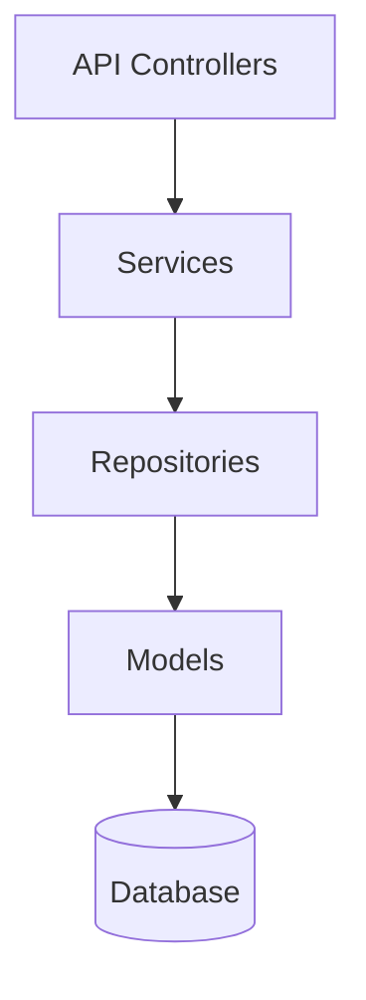

# 🏭 Warehouse Management System RESTFUL-API


A modern warehouse management system built with **Laravel 12** using Repository-Service pattern for clean architecture.

## ✨ Features

- **Inventory Tracking** (Inbound/Outbound)
- **Auto-generated Item Codes** (Smart formatting)
- **Transaction Reversal System**
- **Real-time Stock Reports**

## 🛠️ Technology Stack

| Category       | Technology              | Version |
|---------------|-------------------------|---------|
| Framework     | Laravel                 | 12.x    |
| Language      | PHP                     | 8.2+    |
| Database      | MySQL                   | 8.0+    |


## 🏗️ Architecture



## 🛠️ Technical Implementation

### Domain Models

| Model                | Description                                                                 | Key Attributes                          |
|----------------------|-----------------------------------------------------------------------------|-----------------------------------------|
| **Warehouse**        | Physical storage locations                                                  | `name`, `location`, `capacity`         |
| **Item Category**    | Category for item                                                           | `name`|
| **Item**             | Inventory items                                                             | `name`, `commercial_name`, `code`, `category_id` |
| **TransactionType**  | Classification (Purchase/Sale/Return/etc.)                                  | `name`, `flow` (`in`/`out`/`adjustment in`/`adjustment out`)   |
| **InTransaction**    | Movement records (IN)                                                       | `item_id`, `quantity`, `warehouse_transaction_id` |
| **OutTransaction**   | Movement records (OUT) with audit trail                                     | `item_id`, `quantity`, `warehouse_transaction_id` |


## 🚀 API Documentation

[]()

### Direct Links
- [Download Collection](Docs/warehouse_management.postman_collection.json)


## 📡 API Response Structure

### Consistent Response Format
All API responses follow this standardized JSON structure:

**Success Response**:
```json
{
  "status": "success",
  "code": 200,
  "data": {
    /* endpoint-specific data */
  },
  "meta": {
    /* pagination/aggregation data */
  }
}

